# CorridorKey — RunPod Serverless Worker

A thin RunPod serverless wrapper around [nikopueringer/CorridorKey](https://github.com/nikopueringer/CorridorKey) — the neural green-screen un-mixing engine by Corridor Digital. This worker accepts a green-screen video (or image sequence), optionally generates an `AlphaHint` via BiRefNet or GVM, runs `clip_manager.run_inference`, and returns the compositing-grade outputs (FG, Matte, Comp, Processed) as inline base64 and/or S3 URLs. The pipeline code here is pure infrastructure — **all of the actual keying models, math, and licensing come from upstream CorridorKey (CC BY-NC-SA 4.0)**. See the [Credits + License](#credits--license) section.

## Architecture

```mermaid
flowchart LR
    Client["Client<br/>(HTTP POST /runsync)"] --> RP["RunPod Serverless<br/>Endpoint"]
    RP --> H["rp_handler.py<br/>(handler)"]
    H --> V{"_validate_job"}
    V -- ok --> P["pipeline.process_job"]
    V -- err --> ERR["error response"]
    P --> PREP["_prepare_clip_folder<br/>(download/decode inputs)"]
    PREP --> SCAN["_scan_single_clip<br/>(ClipEntry)"]
    SCAN --> A["_ensure_alpha<br/>(BiRefNet / GVM / provided)"]
    A --> CM["clip_manager.run_inference<br/>(CorridorKey engine)"]
    CM --> OUT["Output/<br/>(FG, Matte, Comp, Processed)"]
    OUT --> STITCH["ffmpeg<br/>(Comp PNGs -> comp.mp4)"]
    STITCH --> EXT["_maybe_externalize_outputs"]
    EXT -- BUCKET_ENDPOINT_URL set --> S3["S3 / R2<br/>(rp_upload)"]
    EXT -- inline --> B64["base64 in response"]
    S3 --> RESP["JSON response<br/>(urls + metadata)"]
    B64 --> RESP
    RESP --> Client
```



## Input Schema

One of `video` or `frames` is required; everything else is optional. `alpha_hint` triggers the `provided` alpha path (otherwise BiRefNet/GVM will fill in). `video`, `frames`, and `alpha_hint` each accept `url`, `base64`, or `path` — whichever is first non-empty wins.

```json
{
  "input": {
    "clip_name": "my_shot",
    "video": {
      "url": "https://example.com/plate.mp4",
      "base64": "<optional b64 payload>",
      "path": "/runpod-volume/plate.mp4",
      "filename": "plate.mp4"
    },
    "frames": {
      "url": "https://example.com/frames.zip",
      "base64": "<optional b64 zip bytes>",
      "path": "/runpod-volume/frames/"
    },
    "alpha_hint": {
      "kind": "video",
      "url": "https://example.com/alpha.mp4",
      "base64": "<optional b64>",
      "path": "/runpod-volume/alpha.mp4",
      "filename": "alpha.mp4"
    },
    "settings": {
      "alpha_source": "auto",
      "birefnet_usage": "General",
      "birefnet_dilate": 0,
      "input_is_linear": false,
      "despill_strength": 0.5,
      "auto_despeckle": true,
      "despeckle_size": 400,
      "refiner_scale": 1.0,
      "image_size": 2048,
      "tiled_inference": false,
      "generate_comp": true,
      "gpu_post_processing": false,
      "max_frames": null,
      "device": "auto",
      "output_formats": ["comp_mp4", "comp_preview", "fg_zip", "matte_zip", "processed_zip"]
    }
  }
}
```

### Field reference

| Field | Type | Default | Notes |
|---|---|---|---|
| `clip_name` | string | `clip_<uuid8>` | Name of the clip folder inside the scratch job dir. |
| `video` | object | — | Mutually exclusive with `frames`. Accepts `url` / `base64` / `path` + optional `filename` for extension sniffing (`.mp4`, `.mov`, `.mkv`, `.avi`). |
| `frames` | object | — | Zip of image frames via `url`/`base64`, or a local directory via `path`. Supported image ext: `.png .jpg .jpeg .exr .tif .tiff .bmp`. |
| `alpha_hint` | object | — | Optional pre-computed matte. `kind: "video"` (single file) or `kind: "zip"` (zip of PNG frames). |
| `settings.alpha_source` | enum | `"auto"` | One of `auto`, `birefnet`, `gvm`, `provided`. `auto` falls back to BiRefNet when no hint was supplied. |
| `settings.birefnet_usage` | string | `"General"` | Any key accepted by `BiRefNetModule.wrapper.usage_to_weights_file`. |
| `settings.birefnet_dilate` | int | `0` | Radius (px) passed to `run_birefnet(..., dilate_radius=...)`. |
| `settings.input_is_linear` | bool | `false` | Set `true` if the plate is linear-light (vs sRGB gamma). |
| `settings.despill_strength` | float | `0.5` | Accepts `0..1`; ints `2..10` are auto-scaled by `/10`. |
| `settings.auto_despeckle` | bool | `true` | Morphological cleanup toggle. |
| `settings.despeckle_size` | int | `400` | Pixel-area threshold for despeckling. |
| `settings.refiner_scale` | float | `1.0` | Refiner strength multiplier. |
| `settings.image_size` | int | `2048` | Inference tile size. Common values: `512`, `1024`, `2048`. |
| `settings.tiled_inference` | bool | `false` | Enable tiled inference for large plates. |
| `settings.generate_comp` | bool | `true` | Whether CorridorKey writes the `Comp/` preview folder. |
| `settings.gpu_post_processing` | bool | `false` | Forwards to `InferenceSettings`. |
| `settings.max_frames` | int \| null | `null` | Cap the number of frames to process (useful for smoke tests). |
| `settings.device` | enum | `"auto"` | Passed through `device_utils.resolve_device` — `auto`, `cuda`, `cpu`, etc. |
| `settings.output_formats` | string[] | `["comp_mp4", "comp_preview"]` | Subset of `comp_mp4`, `comp_preview`, `fg_zip`, `matte_zip`, `processed_zip`. |

**Back-compat shortcuts**: `video_url`, `video_base64`, and `video_path` at the top level are rewritten into a `video` object.

A ready-to-run sample lives in [`test_input.json`](./test_input.json).

## Output Schema

Every response is a flat JSON object. Keys are emitted only when the corresponding artifact was produced and the output format was requested.

| Key | When present | Type | Meaning |
|---|---|---|---|
| `status` | always | `"success"` \| `"error"` | Top-level result state. |
| `metadata` | on success | object | `clip_name`, `frame_count`, `input_frames`, `alpha_frames`, `input_kind`, `device`, `fps` (if comp.mp4 produced), `inference_seconds`, `total_seconds`, and an echo of the resolved `settings`. |
| `output_dir` | on success | string | In-container path to the `Output/` directory (used internally for S3 upload). |
| `comp_mp4_base64` | `comp_mp4` requested, ffmpeg present, source was a video, size ≤ `MAX_INLINE_MP4_BYTES`, no S3 configured | string | Base64-encoded MP4 of the Comp PNG sequence. |
| `comp_mp4_url` | `BUCKET_ENDPOINT_URL` set and upload succeeded | string | Public/authenticated URL returned by `rp_upload`. Replaces the inline base64. |
| `comp_mp4_path` | `comp_mp4` produced | string | In-container path to the stitched MP4. Used internally, echoed for debugging. |
| `comp_preview_png_base64` | `comp_preview` requested and `Comp/` has at least one PNG | string | Base64 of the first frame from `Comp/` — handy thumbnail. |
| `fg_zip_base64` | `fg_zip` requested, `FG/` exists, no S3 | string | Base64 of `FG.zip` (EXR sequence). |
| `matte_zip_base64` | `matte_zip` requested, `Matte/` exists, no S3 | string | Base64 of `Matte.zip` (linear alpha EXR sequence). |
| `processed_zip_base64` | `processed_zip` requested, `Processed/` exists, no S3 | string | Base64 of `Processed.zip` (premultiplied RGBA EXR). |
| `fg_zip_url` / `matte_zip_url` / `processed_zip_url` | S3 configured and upload succeeded | string | URLs that replace the corresponding base64 keys. |
| `warnings` | conditional | string[] | Non-fatal warnings, e.g. *"comp_mp4 (N bytes) exceeds MAX_INLINE_MP4_BYTES"*. |
| `error` | on failure | string | Human-readable error message. |
| `error_kind` | on failure | `"input"` \| `"runtime"` | `input` for `JobError` (bad payload), `runtime` for unexpected exceptions. |
| `traceback` | on `runtime` error | string | Full Python traceback, for debugging. |
| `refresh_worker` | always | bool | Mirrors the `REFRESH_WORKER` env var; tells RunPod whether to recycle this worker after the response. |

## Environment Variables

| Name | Default | Purpose |
|---|---|---|
| `BUCKET_ENDPOINT_URL` | *(unset)* | S3-compatible endpoint used by `runpod.serverless.utils.rp_upload`. **Unset → inline base64 only.** Set it (plus AWS-style creds) to upload MP4 / zip artifacts and receive URLs instead. |
| `BUCKET_NAME` | `corridorkey` | Target bucket name for `rp_upload.upload_file_to_bucket`. |
| `MAX_INLINE_MP4_BYTES` | `83886080` (80 MB) | When S3 is **not** configured and `comp.mp4` exceeds this size, the base64 payload is dropped and a warning is added instead of returning a multi-hundred-MB response. |
| `CORRIDORKEY_KEEP_JOB_DIR` | `0` | Set to `1` to keep the per-job scratch folder for post-mortem inspection (defaults to cleanup). |
| `CORRIDORKEY_JOB_ROOT` | `/tmp/corridorkey_jobs` | Parent directory for per-job workspaces (`job_<id>/ClipsForInference/<clip>/...`). Point at a network volume to avoid filling container ephemeral storage. |
| `CORRIDORKEY_SKIP_MODEL_PREFETCH` | `0` | **Build-time.** When `1`, `download_models.py` exits immediately, producing a thin image that relies on runtime/network-volume weight downloads. |
| `SERVE_API_LOCALLY` | `false` | Dev toggle read by `start.sh`. When `true`, launches `rp_handler.py --rp_serve_api --rp_api_host=0.0.0.0` — a local Flask server for manual `curl` testing. |
| `SERVER_INPOD` | `false` | Alias toggle that also flips `start.sh` into local API mode (same behavior as `SERVE_API_LOCALLY=true`). |
| `REFRESH_WORKER` | `false` | When `true`, every response includes `"refresh_worker": true` so RunPod recycles the worker after the job (useful to avoid VRAM fragmentation). |
| `LOG_LEVEL` | `INFO` | Python `logging` level for the handler and pipeline (`DEBUG`, `INFO`, `WARNING`, `ERROR`). |
| `OPENCV_IO_ENABLE_OPENEXR` | `1` | Enables OpenCV's EXR codec. CorridorKey reads/writes linear EXR, so this **must** stay on. |
| `CORRIDORKEY_ROOT` | `/app/CorridorKey` | Path to the vendored CorridorKey source tree. `pipeline.py` injects this into `sys.path`, and `start.sh` runs the handler from this cwd. |
| `CORRIDORKEY_DEVICE` | `auto` | Baked into the image; upstream `device_utils.resolve_device` honors it (`auto`, `cuda`, `cpu`, `mps`). Typically overridden per-request via `settings.device`. |

## Dockerfile Build Args

All defined with `ARG` in [`Dockerfile`](./Dockerfile):

| Build arg | Default | Purpose |
|---|---|---|
| `CORRIDORKEY_REF` | `main` | Git ref/branch/tag/commit of [`nikopueringer/CorridorKey`](https://github.com/nikopueringer/CorridorKey) to check out. The resolved commit SHA is written to `/app/CORRIDORKEY_COMMIT`. |
| `BIREFNET_USAGES` | `"General"` | Space-separated list of BiRefNet usage keys to prefetch (one `--birefnet <usage>` per token). E.g. `BIREFNET_USAGES="General Portrait"`. |
| `SKIP_MODEL_PREFETCH` | `0` | When `1`, skip the entire weights bake-in step. Produces a much smaller image but the first request will stall while HuggingFace downloads ~15 GB of weights. |
| `CUDA_IMAGE` | `nvidia/cuda:12.8.1-cudnn-runtime-ubuntu22.04` | Base CUDA image. The CorridorKey `cuda` extra pins PyTorch 2.8 + torchvision 0.23 built for `cu128`, so pairing with CUDA 12.8 runtime is the supported combination. |
| `PYTHON_VERSION` | `3.11` | Python version that `uv python install` provisions for the venv (`requires-python = ">=3.10, <3.14"` upstream). |

## Quickstart (local)

Prerequisites: Docker 24+, NVIDIA Container Toolkit, and a CUDA 12.8-capable driver on the host (for GPU runs).

```bash
cd worker

# 1. Build (first build is ~15-20 GB because of baked model weights).
docker build \
  --build-arg CORRIDORKEY_REF=main \
  --build-arg BIREFNET_USAGES="General" \
  -t corridorkey-worker:latest .

# 2. Run in local API mode (exposes http://localhost:8000/runsync).
docker run --rm -it --gpus all \
  -p 8000:8000 \
  -e SERVE_API_LOCALLY=true \
  -e LOG_LEVEL=INFO \
  corridorkey-worker:latest

# 3. In another terminal, hit the local endpoint with the sample payload.
curl -X POST http://localhost:8000/runsync \
  -H 'Content-Type: application/json' \
  -d @test_input.json
```

For a CPU-only smoke test, drop `--gpus all` and pass `"settings": { "device": "cpu", "max_frames": 2 }`.

You can also bypass the HTTP layer and drive `pipeline.py` directly (handy for profiling):

```bash
docker run --rm -it --gpus all -v "$PWD:/work" \
  corridorkey-worker:latest \
  /app/CorridorKey/.venv/bin/python /app/pipeline.py \
    --video /work/plate.mp4 --max-frames 4 --device cuda
```

## Deploy to RunPod Serverless

The worker is a plain OCI image — any registry RunPod can pull from works (GHCR, Docker Hub, ECR, RunPod Registry).

```bash
# 1. Tag and push to your registry (example: GHCR).
docker tag corridorkey-worker:latest ghcr.io/<owner>/corridorkey-worker:v1
echo "$GHCR_PAT" | docker login ghcr.io -u <owner> --password-stdin
docker push ghcr.io/<owner>/corridorkey-worker:v1

# 2. Create a serverless template. Adjust container-disk / GPU class as needed.
runpodctl create template \
  --name corridorkey-worker \
  --imageName ghcr.io/<owner>/corridorkey-worker:v1 \
  --containerDiskInGb 40 \
  --ports "8000/http" \
  --env "LOG_LEVEL=INFO" \
  --env "REFRESH_WORKER=false" \
  --env "CORRIDORKEY_JOB_ROOT=/tmp/corridorkey_jobs"
# -> prints <TPL_ID>

# 3. Create the serverless endpoint tied to that template.
runpodctl create endpoint \
  --name corridorkey \
  --templateId <TPL_ID> \
  --gpuIds "NVIDIA RTX A5000,NVIDIA RTX 4090" \
  --workersMin 0 \
  --workersMax 3 \
  --idleTimeout 5
# -> prints <ENDPOINT_ID>

# 4. Invoke /runsync (blocks until the job finishes).
curl -X POST "https://api.runpod.ai/v2/<ENDPOINT_ID>/runsync" \
  -H "Authorization: Bearer $RUNPOD_API_KEY" \
  -H "Content-Type: application/json" \
  -d @test_input.json

# Or fire-and-poll:
curl -X POST "https://api.runpod.ai/v2/<ENDPOINT_ID>/run" ...
curl "https://api.runpod.ai/v2/<ENDPOINT_ID>/status/<JOB_ID>" \
  -H "Authorization: Bearer $RUNPOD_API_KEY"
```

> The exact `runpodctl` subcommand flags vary by CLI version — use `runpodctl create template --help` / `runpodctl create endpoint --help` on your installed version if names differ. The RunPod web console accepts the same inputs.

For outputs larger than ~80 MB, configure S3 credentials on the endpoint (see the [Large output](#large-output--80-mb-dropped-from-base64) troubleshooting entry) so the worker returns URLs instead of dropping the payload.

## Troubleshooting

### PyTorch wheel / CUDA mismatch on build

The `deps` stage runs `uv sync --frozen --no-dev --extra cuda` against the upstream `uv.lock`. That lockfile pins PyTorch 2.8 from the `cu128` index (`https://download.pytorch.org/whl/cu128`). If you switch `CUDA_IMAGE` to an older CUDA base (e.g. `12.1`), the wheels still expect CUDA 12.8 runtime libraries and will fail to load at import time. Either keep the default CUDA 12.8 base or rebuild CorridorKey's lockfile against the CUDA you want — do **not** mix.

### `AlphaHint` missing or empty

When `settings.alpha_source="provided"` but no `alpha_hint` was supplied, `_ensure_alpha` raises `JobError: alpha_source='provided' requires an explicit alpha input`. With `auto` (the default), the worker falls back to BiRefNet using `settings.birefnet_usage` (default `"General"`). If BiRefNet runs but produces no files, you'll see `Alpha generation finished but no AlphaHint was produced` — usually a sign the input was empty or the mask dilation wiped everything out. Try `"alpha_source": "gvm"` (requires the heavy GVM weights, see upstream docs) or pre-compute a rough matte and pass it via `alpha_hint`.

### `ffmpeg not found` (no `comp.mp4` produced)

`_stitch_comp_video` shells out to `ffmpeg`. The Dockerfile installs it via `apt-get install ffmpeg`, so this should never fire in the canonical image. If you're running `pipeline.py` on a host that doesn't have ffmpeg, `comp_mp4` outputs are silently skipped and you'll see `ffmpeg binary not found on PATH; skipping comp video` in the logs. `comp_preview_png_base64` and the zip outputs still work.

### Large output (> 80 MB) dropped from base64

Without `BUCKET_ENDPOINT_URL`, `_maybe_externalize_outputs` enforces `MAX_INLINE_MP4_BYTES` (default 80 MB). When exceeded, the worker removes `comp_mp4_base64` and appends a warning like `comp_mp4 (98345213 bytes) exceeds MAX_INLINE_MP4_BYTES (83886080)` to `warnings[]`. To fix:

- **Recommended**: point at an S3 / R2 bucket by setting `BUCKET_ENDPOINT_URL`, `BUCKET_NAME`, `AWS_ACCESS_KEY_ID`, `AWS_SECRET_ACCESS_KEY`, and (optionally) `AWS_REGION` on the endpoint. The worker will upload the MP4 and return `comp_mp4_url`.
- **Workaround**: bump `MAX_INLINE_MP4_BYTES` (watch for RunPod response size limits), or cap `settings.max_frames` / `settings.image_size` to shrink the output.

### Model prefetch disk usage (~15 GB)

The `models` stage bakes CorridorKey v1.0 (~300 MB) plus one or more BiRefNet checkpoints (~1-2 GB each) into the image. Combined with the CUDA + cuDNN base and the `cuda` torch wheels, the final image weighs in around 15-20 GB. To slim down, set `--build-arg SKIP_MODEL_PREFETCH=1` and mount a RunPod network volume containing the weights at runtime (`CorridorKeyModule/checkpoints/`, `BiRefNetModule/checkpoints/`) — the first request then has to download what's missing from HuggingFace.

### Cold-start optimization (bake vs volume)

There are two supported strategies — pick the one that fits your traffic pattern:

1. **Bake weights into the image** (default). Cold-start is dominated by image pull + CUDA context init. Good when you have a few long-lived warm workers and care about **first-request latency**.
2. **`SKIP_MODEL_PREFETCH=1` + network volume**. Much smaller image → faster pull to a new pod, but the first request on a cold worker has to download weights onto the volume. Good when you frequently scale from 0 and can tolerate one slow request per cold start.

Also consider `REFRESH_WORKER=true` for pipelines that leak GPU memory across jobs (forces a fresh process per request at the cost of losing warm caches).

## Credits + License

This worker is **pure infrastructure**. The inference engine, training, and model weights all come from upstream:

- **CorridorKey** — [github.com/nikopueringer/CorridorKey](https://github.com/nikopueringer/CorridorKey) by Corridor Digital. Licensed under a variant of [CC BY-NC-SA 4.0](https://creativecommons.org/licenses/by-nc-sa/4.0/): free for commercial output (keying footage for a paid project is fine), **not** free for repackaging as a paid inference API. Review the upstream `CorridorKey Licensing and Permissions` section of [`CorridorKey_src/README.md`](../CorridorKey_src/README.md) before deploying commercially.
- **BiRefNet** alpha-hint generator — [ZhengPeng7/BiRefNet](https://huggingface.co/ZhengPeng7) weights downloaded at build time by `download_models.py`.
- **GVM** (optional, Non-Commercial) — [aim-uofa/GVM](https://github.com/aim-uofa/GVM), BSD-2-Clause code + NC-licensed weights.
- **VideoMaMa** (optional, Non-Commercial) — [cvlab-kaist/VideoMaMa](https://github.com/cvlab-kaist/VideoMaMa), CC BY-NC 4.0 + Stability AI Community License on the SVD base.

The code in this directory (`Dockerfile`, `start.sh`, `download_models.py`, `pipeline.py`, `rp_handler.py`, `test_input.json`) is a RunPod wrapper and inherits the upstream CC BY-NC-SA 4.0 terms. Keep the CorridorKey name on any forks. If you want to offer this as a hosted paid API, contact Corridor Digital (`contact@corridordigital.com`) first — the upstream license explicitly disallows reselling inference without an agreement.
